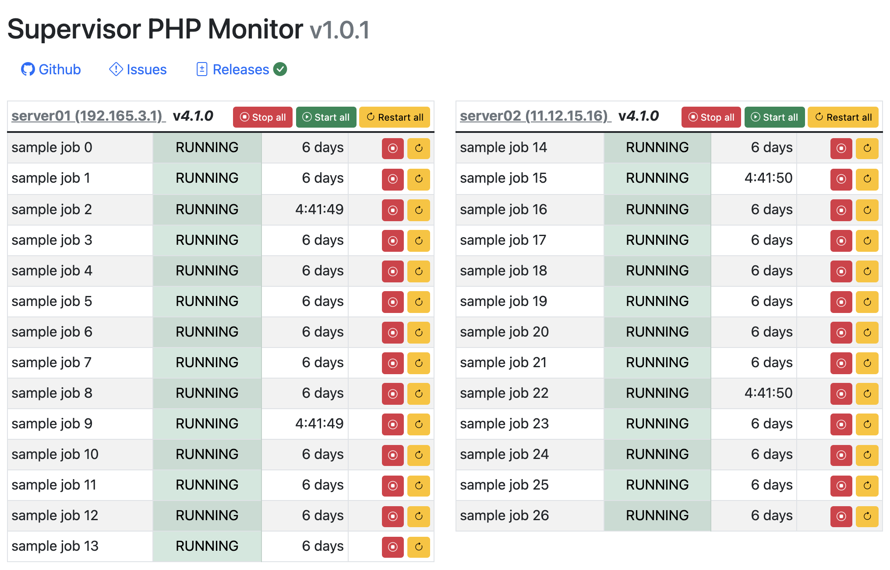

# Supervisord Multi Server Monitoring Tool



A minimum viable product for monitoring a fleet of supervisord instances across multiple servers

Heavily adapted from https://github.com/mlazarov/supervisord_php_monitor, we took out all the stuff we didn't want to use, removed the frameworks
and overhauled the rest for PHP8+

## Features

* Monitor unlimited supervisord servers and processes
* Start/Stop/Restart process
* Monitor process uptime status

## Install

1. Clone supervisord_php_monitor to your vhost/webroot:
    ```
    git clone https://github.com/Innserve/supervisord_php_monitor.git
    ```
2. Run composer to install dependencies
    ```
    composer install
    ```
3. Copy `.env.example` to `.env` and set the `SERVERS` variable
    ```
    cp .env.example .env
    ```
4. Enable/Uncomment `inet_http_server` (found in `supervisord.conf`) for all your supervisord servers and set a password.
    ```ini
    [inet_http_server]
    port=*:9001
    username=supervisor_api
    password=REPLACE_WITH_STRONG_RANDOM_PASSWORD
    ```
    _Do not forget to restart supervisord service after changing supervisord.conf_
5. Set the `SERVERS` JSON value in `.env` (see `.env.example`)
    ```bash
    vim .env
    ```
6. (Optional) Edit `config/config.inc` to change refresh interval / RPC timeout defaults.
7. Configure your web server to point one of your vhosts to `public` directory.
8. Open web browser and enter your vhost URL.

## Local Development

Run a local server:

```bash
composer serve
```

Run basic checks:

```bash
composer check
```

Health endpoints:

- `/healthz.php` (app boot + config parse)
- `/readyz.php` (sample supervisord connectivity check)

## Security Notes (Important)

This app can start/stop/restart supervisor processes. Do not expose it directly to the public internet.

Recommended deployment defaults:

* Put the app behind VPN and/or reverse-proxy authentication (Basic Auth, SSO, etc.)
* Enable supervisord `username`/`password` on every monitored host
* Prefer HTTPS/TLS between the browser, this app, and the monitored endpoints

See:

- `docs/supervisord-upgrade-and-hardening.md` for supervisord upgrade rollout, passwords, firewall rules, and reverse-proxy auth examples
- `docs/architecture.md` for request flow and responsibilities
